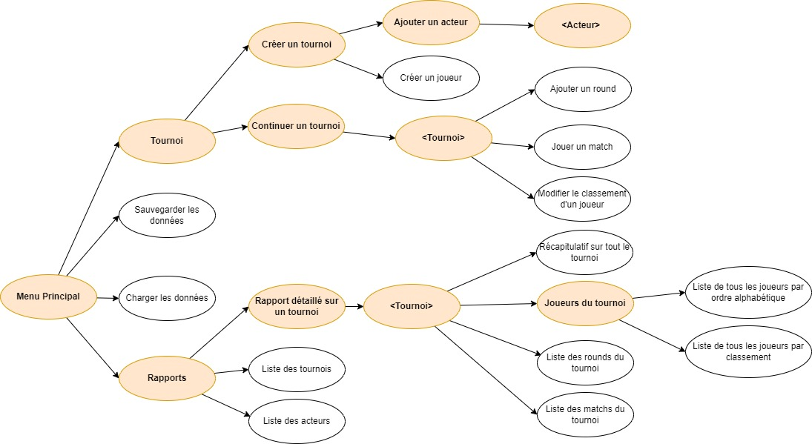

# Project P4

## Steps to install the environment:
```
* Clone the project from github:
git clone https://github.com/tchou93/OCR_PYTHON_P4.git

* Install the last version of python
https://www.python.org/downloads/

* Use a virtual environment
python -m venv env
source env/Scripts/activate

* Install some specific packets on this virtual environment
pip install -r requirements.txt

* Generate Flake8-report
flake8 --format=html --htmldir=flake_report
```

## Step to run the program:
```
python main.py
```

## See the graph of all the menus and some screenshots of the program at bellow



